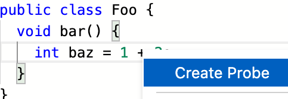
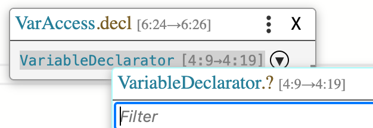
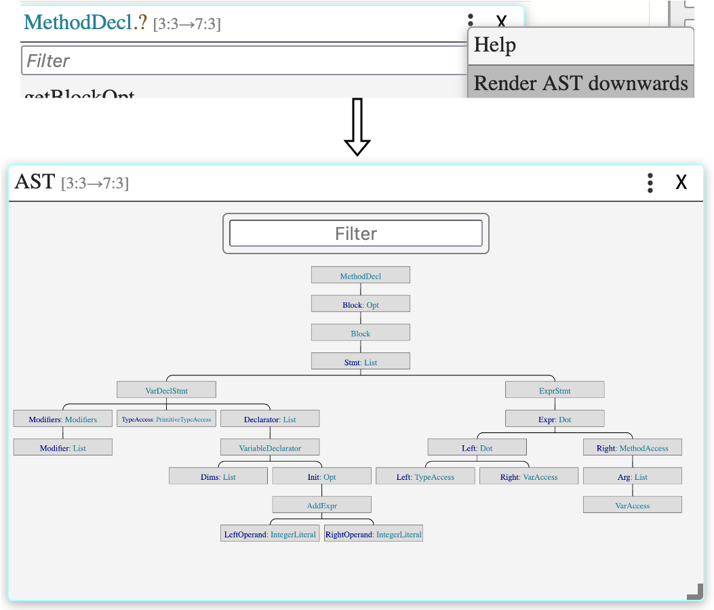
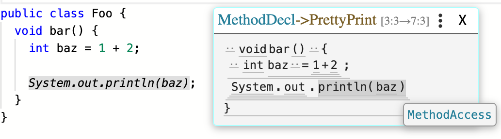
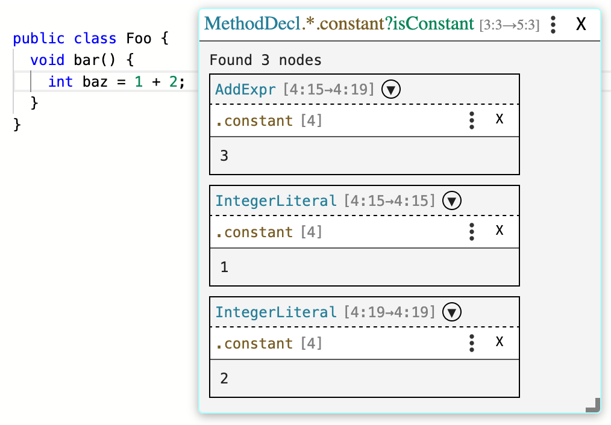
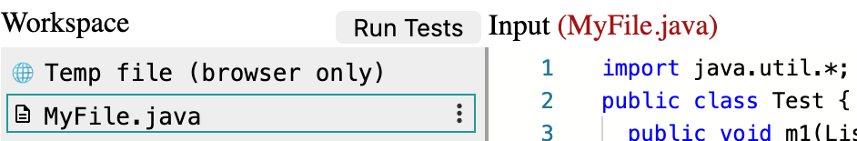
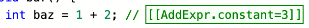
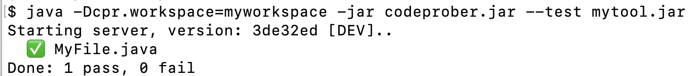
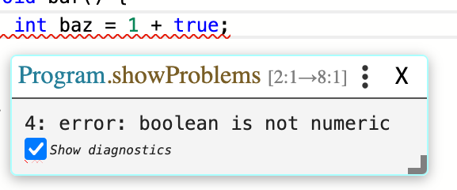

# Features

CodeProber usage is described and demonstrated in the following resources:

- [YouTube: 5 minute overview](https://www.youtube.com/watch?v=d-KvFy5h9W0)
- [Paper: Publication in JSS](https://doi.org/10.1016/j.jss.2024.111980)
- [YouTube: Demonstration at LIVE 2023 (13 minutes)](https://www.youtube.com/watch?v=lkTJ4VL0xtY)

## Basic Features

Listed below are a number of basic features supported in CodeProber.

### Creating Probe from Code


Right click anywhere in the CodeProber editor to create a new probe.

### Creating Probe from Reference


If the output of a probe is an AST reference, you can click it to create a new probe. This allows you to iteratively follow references across the AST.

### AST View


When selecting the property name while creating a new probe, you can click the triple dots, and then "Render AST downwards". This will show the AST structure of tree of the node in question.

### Pretty Print


In the same dropdown where you create the AST view, you can also select "Pretty Print" to access a pretty-printed representation of your AST. For this to work well you must implement the `cpr_pp*` methods described in [AST API](../config/ast_api.md).

### Search Probe


When selecting property name, you can enter a string on the form `*.propName?predicate` and then press enter to create a "search probe".
Search probes can show all nodes in a given subtree that fulfill a predicate, and then evaluate some property on them.
Both `*.propName` and `?predicate` is optional.

- If you just type `*.propName`, then propName is evaluated for **every** node in the given subtree.
- If you just type `?predicate`, then the search probe will list all nodes that pass the predicate, but not evaluate any property on them.

`predicate` can have multiple components, separated by `&`, and each component can have an explicit comparison using `=foo`. If no explicit comparison exists, then it is treated as if you wrote `=true`. For example, you can write `isConstant&type=IntType`.

Predicates can also perform subtype-based filtering using `<:`. A common use case for this is to write something like `this<:Expr` to select all expressions in a tree. The right hand side of `<:` should use either the fullly qualified type of an AST node like `pkg.name.here.Expr`, or just the simple name like `Expr`.

### Workspace


Using the [system property](../config/system_properties.md) `-Dcpr.workspace`, you can expose a filesystem in the CodeProber UI. Any changes you make in the UI will be saved to disk, and any changes to disk will be loaded into in the UI.

### Text Probe


CodeProber interprets text in the format `[[A.b.c]]` as a "text probe". Text probes are evaluated by CodeProber, and the results are rendered in a blue box the editor. If you additionally add `=d`, it will treat the probe as an assertion, and show a green or red box depending on if the assertion passed or not. For example, in the image it evaluated `AddExpr.constant` and compared it with `3`. The comparison succeeded, so the box is green.

Three comparison operators are available: `=`, `!=` and `~=`. They perform equals, not-equals and contains (as in String.contains) comparison respectively. Contains can for example be useful when checking error messages, as they are often quite long and you may not want to check them in their entirety.

For example, a full error message may be `[fileName:lineNumber] Expected int, got boolean in arg 0 to funcName (ERR-CODE 12345)`.
This information is nice to give the end user, but may be a bit verbose to include everywhere in your test files.
Therefore, you can write `[[CallExpr.errors~=Expected int, got boolean]]`, which checks that the error message contains the string "Expected int, got boolean" somewhere, and ignores the rest of the message.

### Testing


By combining a workspace and text probes with assertions, you can write persistent unit tests for your AST.
The tests can be evaluated inside the CodeProber UI by pressing the "Run Tests" button (only visible when a workspace is active).
The tests can also be run in a command-line using something similar to the following command:
```bash
java -Dcpr.workspace=path/to/workspace -jar codeprober.jar --test yourtool.jar
```
The exit code (`$?`) is set to 0 or 1 as expected on success/failure.
This allows you to run your assertions for example in a CI/CD pipeline.

### Diagnostics


The CodeProber text editor can display diagnostics in the form of squiggly lines and arrows.
There are two ways to make diagnostics appear:

1) Print a "diagnostic string" to stdout while a probe is being evaluated
2) Return an object that implements the [cpr_getDiagnostic API](../config/ast_api.md), which returns a "diagnostic string".

A diagnostic string follows one of the following two patterns:

1) **SEVERITY**@**S**;**E**;**MSG**
2) LINE-**TYPE**@**S**;**E**;**COL**

The first pattern is for "squiggly lines".
**SEVERITY** is one of **ERR**, **WARN**, **INFO** or **HINT**.

**S** and **E** are line and column bits packed into a single 32 bit integer in the format 0xLLLLLCCC. For example line 5 column 7 is `20487` (`(5 << 12) + 7`).

**MSG** is any string.

The second pattern is for lines and arrows.
**TYPE** is one of:

- PP (plain-plain) - just a line, no arrow
- PA (plain-arrow) - line in the starting point, arrow in the ending point
- AP (arrow-plain) - opposite of PA.
- AA (arrow-arrow) - an arrow on both sides.

**COL** is a string in the form `#RGBA`.

See also the Diagnostic class in the [AST API](../config/ast_api.md#diagnostic-class).

#### Diagnostic Examples

```java
// A warning (yellow) squiggly between line 5 column 7 and line 5 column 10
"WARN@20487;20490;Hover message here"

// A semitransparent red arrow pointing from line 3 column 2 to line 3 column 5
"LINE-PA@12291;12293;#F007"

// A double-sided green arrow pointing between line 1 column 2 and line 3 column 4
"LINE-AA@4098;8195;#0F0F"
```

## Advanced Features

There are a number of features in CodeProber which are undocumented. They may simply be new, or considered too advanced/unstable for general use.
If you are relying on something not listed in the table above, please reach out (for example by opening an [issue](https://github.com/lu-cs-sde/codeprober/issues)), and we can work on documenting/stabilizing it.
